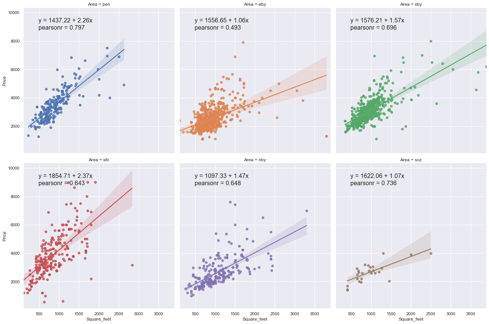

# Data Analyst/Science Projects by Edgar Fonseca
-------------------
This is a portfolio where I present my past projects for data analysis and exploration of machine learning algorithms.
## Kaggle Datasets
------------------
### Employee Fatigue Prediction
[Github](https://github.com/EdgarFonseca94/Portfolio/blob/main/Employee%20Fatigue/Employee%20Burnout%20Out.ipynb)

[nbviewer](https://nbviewer.jupyter.org/github/EdgarFonseca94/Portfolio/blob/main/Employee%20Fatigue/Employee%20Burnout%20Out.ipynb)
- Visualized relationship of fatigue score with independent variables using Seaborn.
- Built machine learning models (Support Vector Regression & Random Forest Regressor) to predict employee fatigue score.
- Utilized RandomizedSearchCV & GridSearchCV to optimize our models.

------------------
### Craigslist Apartment Analysis
[Github](https://github.com/EdgarFonseca94/Portfolio/tree/main/Craigslist)

[Scaper nbviewer](https://nbviewer.jupyter.org/github/EdgarFonseca94/Portfolio/blob/main/Craigslist/Craiglist%20Scraper.ipynb)

[EDA nbviewer](https://nbviewer.jupyter.org/github/EdgarFonseca94/Portfolio/blob/main/Craigslist/Craigslist%20EDA.ipynb)
- Scraped craigslist apartment post using BeatifulSoup & Requests packages
- Cleaned & organized scraped data into a dataframe and saved it to csv format
- Analyzed apartment dataset from the Bay Area to find which areas were more expensive and had the best value
- Built Linear Regression models for each area using square footage and price since square footage had highest correlation with price.

------------------
### Restaurant Ranking Analysis
[Github](https://github.com/EdgarFonseca94/Portfolio/tree/main/Rankings2020)

[nbviewer](https://nbviewer.jupyter.org/github/EdgarFonseca94/Portfolio/blob/main/Rankings2020/Restaurant_250.ipynb)

[Tableau](https://public.tableau.com/profile/edgar.fonseca#!/vizhome/Restaurants2020/Dashboard1)

Summary: Analyzed top 250 restaurants of 2020  dataset found in kaggle to find which type of food was the most popular and which type of restaurants had a change of sales. The author of the dataset stated this dataset would be helpful in finding what restaurants may have suffered from COVID-19. I built a tableau dashboard to show some of the best findings.

